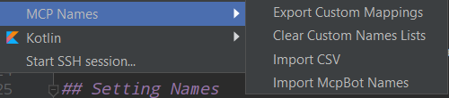
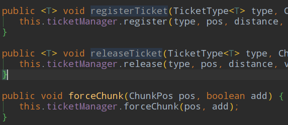
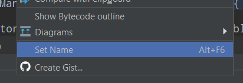
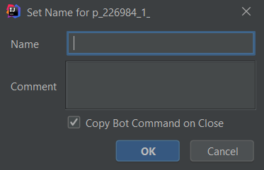

# SRGNamer IDEA Plugin
Plugin to help with assigning MCP names to unassigned names. Likely to eventually be updated to work with the new mapping service when it gets done.

Originally intended for use with [MC Names 1.15](https://github.com/thiakil/MC-Names-1.15), supports generating an McpBot command (to clipboard) and retrieving the test csv exports.

## Licence
Apache License version 2.0

## Installation
Open Settings -> Plugins -> Cog icon -> Install Plugin from Disk -> select zip file from Releases tab

# Usage
A submenu is added to the Tools menu for managing import & export of names.

### Export Custom Mappings
Exports stored names & comments to `methods.csv`, `fields.csv` & `params.csv` in a folder selected.

### Clear Custom Names List
Removes all names from the stored list. Cannot be undone.

### Import CSV
Imports a list of names from all CSVs selected in the dialog. Overwrites any existing names stored for the same SRG name.

### Import McpBot Names
Downloads semi-live methods/fields/params CSVs from [MCPBot Exports](http://export.mcpbot.bspk.rs/) and overwrites names stored in the plugin's custom list. Works as a background task (check the status bar). No real error handling (soon™). 

## Setting Names
SRG names found will be "folded" and placeholder text set (which will be the SRG name if none is set in the plugin's list).

To set a name, right click a name and select Set Name (default shortcut alt-F6).

Enter a name and comment and press OK to save to the local list. When the checkbox is ticked, it will copy the command to your clipboard for pasting into an IRC window (integrating an IRC client into the plugin is complicated).